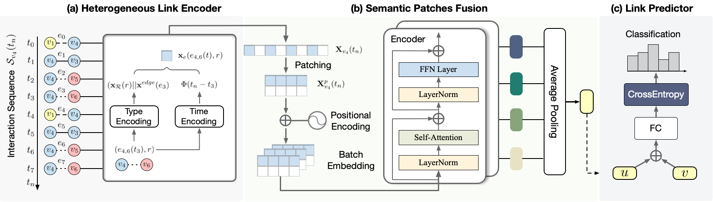

# Simplifying Temporal Heterogeneous Network for Continuous-Time Link Prediction

This repository provides an official **PyTorch** implementation of *STHN: Simplifying Temporal Heterogeneous Network for Continuous-Time Link Prediction (CIKM 2023).* [paper](https://dl.acm.org/doi/10.1145/3583780.3615059)

<p align="center">
  
</p>

Model architecture. (a) Heterogeneous Link Encoder with two components - type encoding and time encoding embeds historical interaction sequence to produce temporal link representation. (b) In semantic patches fusion, sequential representations are divided into different patches, which are set as the token input of Encoder. Average mean pooling is used to compress the patch embeddings into a single vector. (c) Combining the representations of nodes 𝑢 and 𝑣, the link predictor makes link prediction with FC layer and CrossEntropy loss.

### Python environment setup with Conda

```bash
# create conda virtual enviroment
conda create --name sthn python=3.9

# activate environment
conda activate sthn

# pytorch 
pip install torch==1.13.0+cu116 --extra-index-url https://download.pytorch.org/whl/cu116

# pytorch-geometric
pip install torch-geometric torch_scatter torch_sparse torch_cluster torch_spline_conv -f https://data.pyg.org/whl/torch-1.13.0+cu116.html

# pybind11, torchmetrics and pandas
pip install pybind11 torchmetrics==0.11.0 pandas
```

### Data Preparation

Prepare data for STHN by either (1) downloading benchmarked data in the paper or (2) formating your own data.

**MathOverflow** can be found in [Stanford Snap Datasets](https://snap.stanford.edu/data/sx-mathoverflow.html). You can access the original **Netflix** dataset [here](https://www.kaggle.com/datasets/netflix-inc/netflix-prize-data). We provide the **Movielens** data for testing in ./DATA/movie/.

**Your Own Data:** To use your own data with STHN, you will need an edge list file containing the streaming edges of your heterogeneous graph. Example can be found in ./DATA/movie/edges.csv


### How to start

### 1. Compile C++ smapler (from [tgl](https://github.com/amazon-research/tgl))

```shell
python setup.py build_ext --inplace
```
### 2. Data pre-process

```shell
python gen_graph.py --data movie
```
### 3. Link prediction (from [GraphMixer](https://github.com/CongWeilin/GraphMixer))

```shell
python train.py --data movie --max_edges 50
```
### 4. Link type prediction

```shell
python train.py --data movie --max_edges 50 --predict_class
```

## How to Cite

If you find this work useful, please consider citing it as follows:

```bibtex
@article{ce2023sthn,
  title={Simplifying Temporal Heterogeneous Network for Continuous-Time Link Prediction},
  author={Ce Li and Rongpei Hong and Xovee Xu and Goce Trajcevski and Fan Zhou},
  journal={Proceedings of the ACM International Conference on Information \& Knowledge Management},
  year={2023}
}
```
